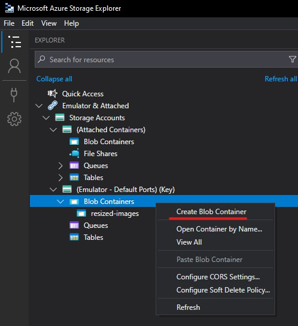
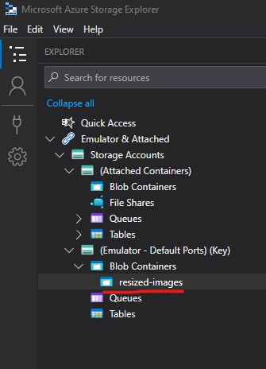
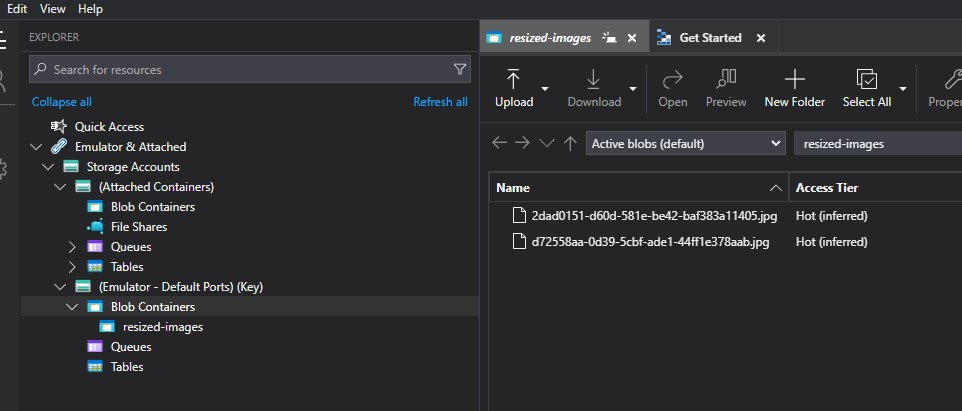

# FileResizer

## Introduction

This solution demonstrates [durable function](https://learn.microsoft.com/en-us/azure/azure-functions/durable/durable-functions-overview?tabs=in-process%2Cnodejs-v3%2Cv1-model&pivots=csharp) usage.

Here are a couple of videos that give a good introduction to durable functions;
* https://www.youtube.com/watch?v=rmz78kIfPVw
* https://www.youtube.com/watch?v=eYXtv76Hhdg

I've compiled some notes on durable functions [here](https://1drv.ms/o/c/c0a40b9917dd3f13/EkNo64Wb8rJBqF6a17tcIHsB9BXUpQMhrYjzFqlMh5rJWg?e=L8WY7g)

## Setup

1. Make sure you've followed the local setup guide in the root readme if you intend to run this code using local emulated Azure resources.
2. Open Azure Storage Explorer
3. In the explorer find emulated blob containers and right click, chose "Create Blob Container";
   


4. Name your new blob container "resized-images", you should end up with this;
   


## Usage

There are multiple endpoints in this project usage instructions will be detailed below

### Hello Cities

Hello cities takes in an array of city names and task delay values, it returns a list of hello messages for each after waiting for the define delay time (in milliseconds).

How to use;
1. Run the FileResizer function and wait for function to finish bootstrapping
2. Send a post request to http://localhost:7196/api/Function1_HttpStart with the following JSON body;
	```json
	[
		{
			"name": "Tokyo",
			"taskDelay": 10000
		},
		{
			"name": "Seattle",
			"taskDelay": 5000
		},
		{
			"name": "London",
			"taskDelay": 0
		},
		{
			"name": "Madrid",
			"taskDelay": 50
		}    
	]
	```
3. The API will respond with the JSON like the following;
	```json
	{
		"id": "e244025e997f4475a41877e10aa0670e",
		"purgeHistoryDeleteUri": "http://localhost:7196/runtime/webhooks/durabletask/instances/e244025e997f4475a41877e10aa0670e?code=zwLsZ-CVl2k4U4fQA-s3wlvNYT0d7oji91fG6bAyBhUXAzFuIvyyhw==",
		"sendEventPostUri": "http://localhost:7196/runtime/webhooks/durabletask/instances/e244025e997f4475a41877e10aa0670e/raiseEvent/{eventName}?code=zwLsZ-CVl2k4U4fQA-s3wlvNYT0d7oji91fG6bAyBhUXAzFuIvyyhw==",
		"statusQueryGetUri": "http://localhost:7196/runtime/webhooks/durabletask/instances/e244025e997f4475a41877e10aa0670e?code=zwLsZ-CVl2k4U4fQA-s3wlvNYT0d7oji91fG6bAyBhUXAzFuIvyyhw==",
		"terminatePostUri": "http://localhost:7196/runtime/webhooks/durabletask/instances/e244025e997f4475a41877e10aa0670e/terminate?reason={{text}}&code=zwLsZ-CVl2k4U4fQA-s3wlvNYT0d7oji91fG6bAyBhUXAzFuIvyyhw==",
		"suspendPostUri": "http://localhost:7196/runtime/webhooks/durabletask/instances/e244025e997f4475a41877e10aa0670e/suspend?reason={{text}}&code=zwLsZ-CVl2k4U4fQA-s3wlvNYT0d7oji91fG6bAyBhUXAzFuIvyyhw==",
		"resumePostUri": "http://localhost:7196/runtime/webhooks/durabletask/instances/e244025e997f4475a41877e10aa0670e/resume?reason={{text}}&code=zwLsZ-CVl2k4U4fQA-s3wlvNYT0d7oji91fG6bAyBhUXAzFuIvyyhw=="
	}
	```
4. You can use the "statusGueryGetUri" in a GET request to track the status of the request and eventually get the output from the function, output will look something like this;
	```json
	{
		"name": "SayHelloOrchestratorFunction",
		"instanceId": "e244025e997f4475a41877e10aa0670e",
		"runtimeStatus": "Completed",
		"input": [
			{
				"Name": "Tokyo",
				"TaskDelay": 10000
			},
			{
				"Name": "Seattle",
				"TaskDelay": 5000
			},
			{
				"Name": "London",
				"TaskDelay": 0
			},
			{
				"Name": "Madrid",
				"TaskDelay": 50
			}
		],
		"customStatus": null,
		"output": [
			"Hello Tokyo!",
			"Hello Seattle!",
			"Hello London!",
			"Hello Madrid!"
		],
		"createdTime": "2024-05-23T15:12:01Z",
		"lastUpdatedTime": "2024-05-23T15:12:17Z"
	}
	```

### Image Resizer

Image resizer takes in an object with width, height and array of base 64 encoded images, resizes them to the requested width / height (note the "Max" mode is actually used [see here](https://docs.sixlabors.com/api/ImageSharp/SixLabors.ImageSharp.Processing.ResizeMode.html?q=ResizeMode) for details), stores the resized images in the Azure blob container we set up earlier and returns an array of objects containing the image names and Azure blob URI's

How to use;
1. Pick as many images as you want and get the base 64 encoded text for them, there are numerous ways of doing this, the author used [this website](https://base64.guru/converter/encode/image)
2. Make a post request to http://localhost:7196/api/ResizeImageOrchestratorFunction_HttpStart with the following JSON body;
	```json
	{
		"width": 200,
		"height": 400,
		"files": [
			"file-1-base64-string",
			"file-2-base64-string"
		]
	}
	```
	replacing "file-X-base64-string" with the actual base64 string you obtained in step 1.
3. The API will respond with JSON like the following;
	```json
	{
		"id": "eea084f9e74345da8622d0f71a13be70",
		"purgeHistoryDeleteUri": "http://localhost:7196/runtime/webhooks/durabletask/instances/eea084f9e74345da8622d0f71a13be70?code=zwLsZ-CVl2k4U4fQA-s3wlvNYT0d7oji91fG6bAyBhUXAzFuIvyyhw==",
		"sendEventPostUri": "http://localhost:7196/runtime/webhooks/durabletask/instances/eea084f9e74345da8622d0f71a13be70/raiseEvent/{eventName}?code=zwLsZ-CVl2k4U4fQA-s3wlvNYT0d7oji91fG6bAyBhUXAzFuIvyyhw==",
		"statusQueryGetUri": "http://localhost:7196/runtime/webhooks/durabletask/instances/eea084f9e74345da8622d0f71a13be70?code=zwLsZ-CVl2k4U4fQA-s3wlvNYT0d7oji91fG6bAyBhUXAzFuIvyyhw==",
		"terminatePostUri": "http://localhost:7196/runtime/webhooks/durabletask/instances/eea084f9e74345da8622d0f71a13be70/terminate?reason={{text}}&code=zwLsZ-CVl2k4U4fQA-s3wlvNYT0d7oji91fG6bAyBhUXAzFuIvyyhw==",
		"suspendPostUri": "http://localhost:7196/runtime/webhooks/durabletask/instances/eea084f9e74345da8622d0f71a13be70/suspend?reason={{text}}&code=zwLsZ-CVl2k4U4fQA-s3wlvNYT0d7oji91fG6bAyBhUXAzFuIvyyhw==",
		"resumePostUri": "http://localhost:7196/runtime/webhooks/durabletask/instances/eea084f9e74345da8622d0f71a13be70/resume?reason={{text}}&code=zwLsZ-CVl2k4U4fQA-s3wlvNYT0d7oji91fG6bAyBhUXAzFuIvyyhw=="
	}
	```
4. You can make a get request to the statusQueryGetUri URL to get a update of the status of the request and eventually (once the function has completed) data about the resized files, it'll look like this;
	```json
	{
		"name": "ResizeImageOrchestratorFunction",
		"instanceId": "eea084f9e74345da8622d0f71a13be70",
		"runtimeStatus": "Completed",
		"input": {
			"Height": 400,
			"Width": 200,
			"Files": [
				"file-1-base64",
				"file-2-base64"
			]
		},
		"customStatus": null,
		"output": [
			{
				"FileName": "d72558aa-0d39-5cbf-ade1-44ff1e378aab.jpg",
				"FileUri": "http://127.0.0.1:10000/devstoreaccount1/resized-images/d72558aa-0d39-5cbf-ade1-44ff1e378aab.jpg"
			},
			{
				"FileName": "2dad0151-d60d-581e-be42-baf383a11405.jpg",
				"FileUri": "http://127.0.0.1:10000/devstoreaccount1/resized-images/2dad0151-d60d-581e-be42-baf383a11405.jpg"
			}
		],
		"createdTime": "2024-05-23T15:23:07Z",
		"lastUpdatedTime": "2024-05-23T15:23:11Z"
	}
	```
5. You should see an object in the "output" array for each image you requested to be resized in your original post request, you should also see your images in the "resized-images" blob container;
	
