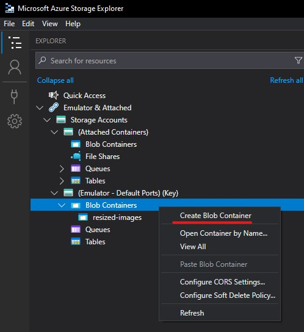
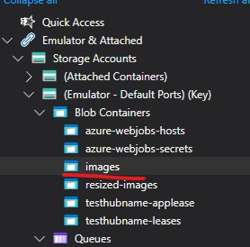

# HTTP Function

## Introduction

This solution demonstrates a basic HTTP function, you call the function endpoint and are returned an image from blob storage.

## Setup

1. Make sure you've followed the local setup guide in the root readme if you intend to run this code using local emulated Azure resources.
2. Open Azure Storage Explorer
3. In the explorer find emulated blob containers and right click, chose "Create Blob Container";

4. Create a container named "images", you should end up with;

5. Upload any jpeg image you want to the container, make sure it is named "test-image.jpeg" though.

## Usage

Visit http://localhost:7049/api/Function1 in your browser, you should get a download of the image you uploaded
