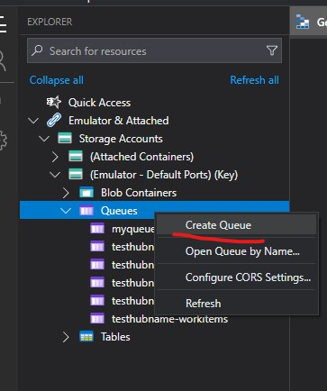
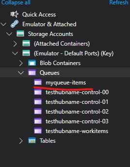

# Queue Function

## Introduction

This solution demonstrates [Azure Storage Queues](https://learn.microsoft.com/en-us/azure/storage/queues/storage-queues-introduction) usage.

## Setup

1. Make sure you've followed the local setup guide in the root readme if you intend to run this code using local emulated Azure resources.
2. Open Azure Storage Explorer
3. In the explorer find Queues and right click, chose "Create Blob Container";



5. Add a queue named "myqueue-items", you should end up with;



## Usage

There is a single endpoint for this solution, the endpoint takes in an array of JSON objects, these objects are pushed into the "myqueue-items" as separate messages, finally an Azure function that is triggered by the "myqueue-items" will output a log entry for each message it receives.

Using the endpoint;
1. Make a HTTP POST request to http://localhost:7021/api/RunMessages
2. The body should contain the following JSON;
```json
[
    {
        "text": "hello1"
    },
    {
        "text": "hello2"
    },
    {
        "text": "hello3"
    }    
]
```
3. You should expect the VS debug console output to contain something like the following;
```
[2024-05-30T14:36:00.906Z] C# Queue trigger function processed: hello1
[2024-05-30T14:36:00.914Z] C# Queue trigger function processed: hello3
[2024-05-30T14:36:00.915Z] C# Queue trigger function processed: hello2
```
