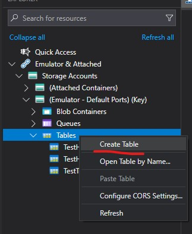
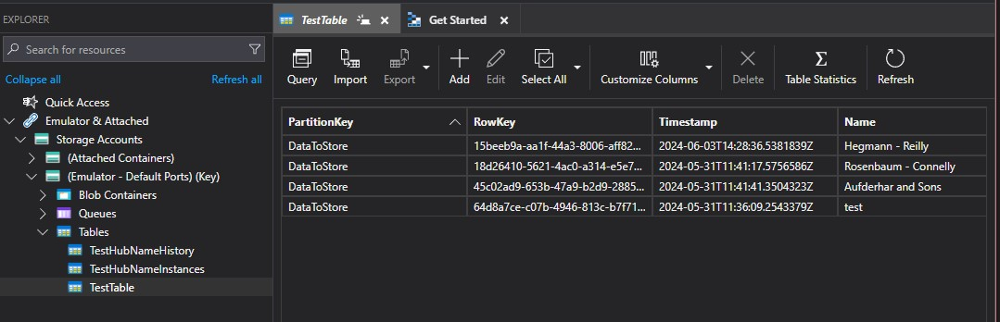

# Table Storage

## Introduction
This solution demonstrates [Azure table storage](https://learn.microsoft.com/en-us/azure/storage/tables/table-storage-overview)

## Setup
1. Make sure you've followed the local setup guide in the root readme if you intend to run this code using local emulated Azure resources.
2. Open Azure Storage Explorer
3. In the explorer find emulated tables and right click, chose "Create Blob Container";



4. Name the new table "TestTable"

## Usage

1. Make a POST HTTP request to http://localhost:7092/api/StoreData
2. The POST body should be JSON containing a GUID for the id field, a string for the name field and a date / time for the timeStamp field, if you are using postman you can use this body;
	```json
	{
		"id": "{{$guid}}",
		"name": "{{$randomCompanyName}}",
		"timeStamp": "2024-01-01"
	}
	```
3. Once the request has been processed you should see some data stored in the "TestTable" storage table you created earlier;


