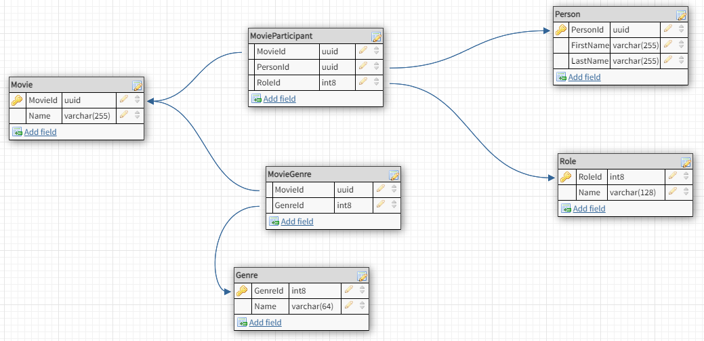

# Sandbox database

## Introduction

A sample database for use in other sandbox applications

## Contents

## Instructions

See https://github.com/Ian-Webster/sandbox/tree/main/sandbox-database/postgres for instructions on creating the Sandbox database

## Notes

Database diagram created with https://app.dbdesigner.net/ 

Mock data provided by https://www.onlinedatagenerator.com/home/demo

## Version history

- v1 initial set up
